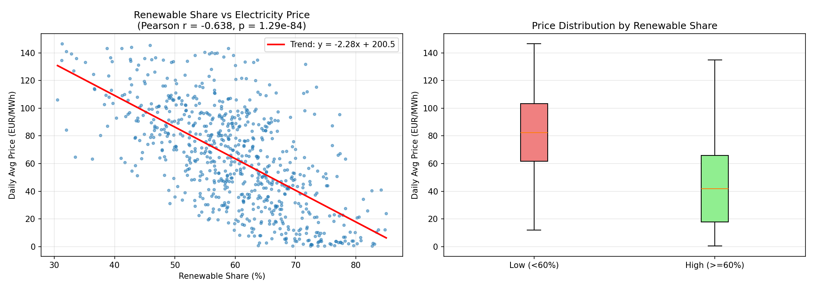
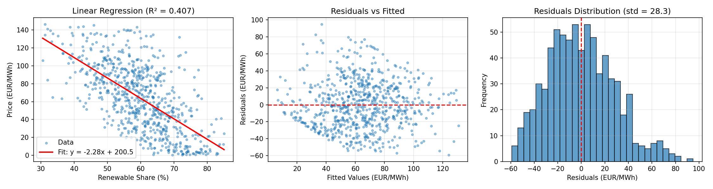
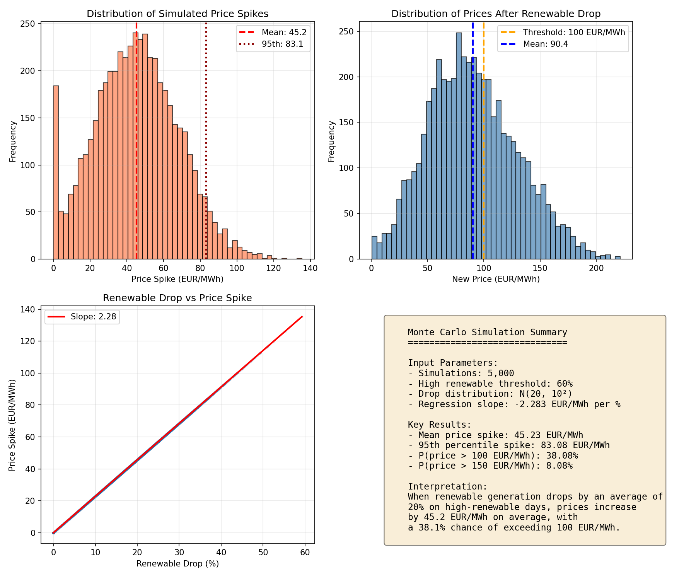

# Renewables Risk Simulator

## Research Question

**How does high renewable penetration drive electricity price volatility in Spain's grid?**

As Spain increases its renewable energy capacity, the grid faces new challenges. Renewable generation (wind, solar, hydro) is inherently variable - clouds pass, wind dies down, reservoir levels fluctuate. When renewable output drops suddenly, dispatchable generation (gas, coal) must ramp up quickly, often at premium prices. This project quantifies that price risk using real data from Spain's electricity grid.

> **Note**: This analysis uses the **full renewable energy mix** (hydro, wind, solar PV, solar thermal, and other renewables) - not just solar and wind. The data infrastructure already tracks all 19 generation sources individually, enabling future research into source-specific price impacts.

## Key Findings (Jan 2024 - Dec 2025)

Analysis of **730 days** of Spanish electricity data reveals:

| Metric | Value |
|--------|-------|
| Average renewable share | 59.7% |
| Renewable share range | 30.5% - 85.1% |
| Average daily price | 64.12 EUR/MWh |
| Price range | 0.40 - 146.52 EUR/MWh |

### Strong Negative Correlation

**Pearson correlation: -0.64** (p < 0.001)

Higher renewable penetration is strongly associated with lower electricity prices. Each 1% increase in renewable share reduces prices by approximately **2.28 EUR/MWh**.



*Left: Scatter plot showing the inverse relationship between renewable share and price. Right: Price distribution comparison - high renewable days (≥60%) average 45 EUR/MWh vs 83 EUR/MWh for low renewable days.*

### Linear Regression Model

```
price = -2.28 × renewable_share + 200.52
R² = 0.41 (41% of price variance explained by renewable share alone)
```



*The regression coefficient (-2.28) quantifies the price sensitivity: a 10% drop in renewable generation leads to a ~23 EUR/MWh price increase.*

### Monte Carlo Risk Simulation

What happens when renewable generation suddenly drops? We simulated 5,000 scenarios where high-renewable days (≥60%) experience random drops averaging 20%:

| Risk Metric | Value |
|-------------|-------|
| Mean price spike | +45.23 EUR/MWh |
| 95th percentile spike | +83.08 EUR/MWh |
| 99th percentile spike | +99.71 EUR/MWh |
| P(price > 100 EUR/MWh) | 38.1% |
| P(price > 150 EUR/MWh) | 8.1% |



*The simulation shows that sudden renewable drops can cause significant price spikes, with ~38% of scenarios resulting in prices exceeding 100 EUR/MWh.*

### Key Insight

> **A 20% renewable drop → ~45 EUR/MWh price spike**
>
> 95th percentile spike: 83 EUR/MWh
>
> Coefficient: 2.28 EUR/MWh per 1% renewable drop

---

## Why Docker?

This project is containerized for three key reasons:

**1. Reproducibility**
- Anyone can replicate these exact results with a single command
- No "works on my machine" issues - the analysis environment is frozen
- Pinned dependencies ensure consistent behavior across time

**2. Data Pipeline Isolation**
- API calls, data processing, and analysis run in an isolated environment
- No risk of conflicting with existing Python installations
- Clean separation between the host system and analysis code

**3. Deployment Ready**
- Can be scheduled as a cron job or CI/CD pipeline
- Easy to deploy on cloud platforms (AWS ECS, GCP Cloud Run, etc.)
- Same container works locally and in production

```bash
# One command to reproduce the entire analysis
docker run -v $(pwd)/outputs:/outputs -v $(pwd)/data:/data renewables-risk-sim
```

---

## Data Sources

This project uses Spain's official electricity data from **REData API** (Red Eléctrica de España):

| Data | Endpoint | Granularity |
|------|----------|-------------|
| Electricity Prices | `/es/datos/mercados/precios-mercados-tiempo-real` | 15-min intervals |
| Generation Balance | `/es/datos/balance/balance-electrico` | Daily |

**No API token required** - REData provides open access to Spanish grid data.

### Data Processing

- **Prices**: 15-minute spot market prices aggregated to daily averages (EUR/MWh)
- **Renewable Share**: `(hydro + wind + solar PV + solar thermal + other renewables) / total demand × 100%`
- **Output**: Merged dataset with 26 columns covering all generation sources

---

## Quick Start

### Build the Image

```bash
docker build -t renewables-risk-sim .
```

### Run Full Pipeline (Fetch + Analyze)

```bash
docker run -v $(pwd)/outputs:/outputs -v $(pwd)/data:/data renewables-risk-sim
```

Custom date range:

```bash
docker run -v $(pwd)/outputs:/outputs -v $(pwd)/data:/data \
    renewables-risk-sim \
    all --start-date 2024-01-01 --end-date 2024-06-30
```

### Run Individual Steps

**Fetch data only:**

```bash
docker run -v $(pwd)/data:/data renewables-risk-sim \
    fetch --start-date 2024-01-01 --end-date 2024-12-31
```

**Analyze existing data:**

```bash
docker run -v $(pwd)/outputs:/outputs -v $(pwd)/data:/data renewables-risk-sim \
    analyze
```

**Customize Monte Carlo parameters:**

```bash
docker run -v $(pwd)/outputs:/outputs -v $(pwd)/data:/data renewables-risk-sim \
    analyze --threshold 50 --drop-mean 15 --drop-std 5
```

---

## Project Structure

```
renewables-risk-sim/
├── main.py              # CLI entry point with subcommands
├── data_fetch.py        # REData API fetching and parsing
├── analysis.py          # Statistical analysis and Monte Carlo
├── utils.py             # Shared utilities
├── requirements.txt     # Pinned Python dependencies
├── Dockerfile           # Container definition
├── README.md            # This file
├── data/                # Raw data output (CSV)
└── outputs/             # Analysis results (plots, reports)
```

## Command Line Interface

```
usage: main.py {fetch,analyze,all} ...

Commands:
  fetch     Fetch data from REData API
  analyze   Run analysis on fetched data
  all       Run fetch and analyze in sequence

Subcommand options:
  --data-dir      Directory for data files (default: /data)
  --output-dir    Directory for output plots and reports (default: /outputs)
  --start-date    Start date YYYY-MM-DD (fetch, all)
  --end-date      End date YYYY-MM-DD (fetch, all)
  --threshold     High renewable threshold % for Monte Carlo (default: 60)
  --drop-mean     Mean renewable drop % for simulation (default: 20)
  --drop-std      Std dev of renewable drop % (default: 10)
```

## Output Files

| File | Description |
|------|-------------|
| `spain_renewables_prices.csv` | Raw merged dataset (730 rows, 26 columns) |
| `exploratory_analysis.png` | Scatter plot and box plot |
| `regression_diagnostics.png` | Regression fit and residual analysis |
| `monte_carlo_simulation.png` | Price spike distribution |
| `report.json` | Complete statistical results |

---

## Methodology

### Part 1: Data Collection
- Fetch 15-minute interval prices from REData API
- Fetch daily generation balance (19 sources + storage)
- Aggregate prices to daily averages
- Calculate renewable and non-renewable shares
- Merge datasets by date

### Part 2: Exploratory Analysis
- Scatter plot: renewable share vs. price
- Pearson correlation coefficient
- Price volatility comparison: high renewable days (≥60%) vs. low

### Part 3: Linear Regression
- Model: `price ~ renewable_share`
- Extract coefficient for price impact per percentage point change
- Diagnostic plots: residuals vs fitted, residual distribution

### Part 4: Monte Carlo Simulation
- Filter high renewable days (≥60% share)
- Simulate random drops: `Normal(mean=20%, std=10%)`
- Calculate: `new_price = base_price + (drop_pct × -coefficient)`
- 5,000 simulation runs
- Output: mean spike, 95th percentile, probability of extreme prices

---

## Generation Sources Tracked

**Renewable (7 sources):**
Hydro, Wind, Solar PV, Solar Thermal, Hydro-wind, Other renewable, Renewable waste

**Non-Renewable (8 sources):**
Nuclear, Combined Cycle (gas), Coal, Diesel, Gas Turbine, Steam Turbine, Cogeneration, Non-renewable waste

**Storage (4 sources):**
Pumped hydro (generation/consumption), Battery (charge/discharge)

---

## Local Development

```bash
# Install dependencies
pip install -r requirements.txt

# Run locally
mkdir -p data outputs
python main.py all --data-dir ./data --output-dir ./outputs \
    --start-date 2024-01-01 --end-date 2024-12-31
```

---

## Future Work

This project lays the groundwork for deeper analysis. Potential extensions include:

**Source-Specific Analysis**
- The dataset already tracks all 19 generation sources individually
- Future work could analyze how drops in specific sources (e.g., wind alone, solar alone) affect prices differently
- Hydro variability (seasonal, drought conditions) could be studied separately from wind/solar intermittency

**Cloud Deployment**
- Deploy the container to AWS (ECS/Fargate) or GCP Cloud Run
- Schedule automated daily/weekly data refreshes
- Set up alerts for high-risk price conditions

**Enhanced Modeling**
- Multivariate regression including weather data, demand forecasts
- Time-series models (ARIMA, Prophet) for price forecasting
- Machine learning approaches for non-linear relationships

---

## License

MIT
